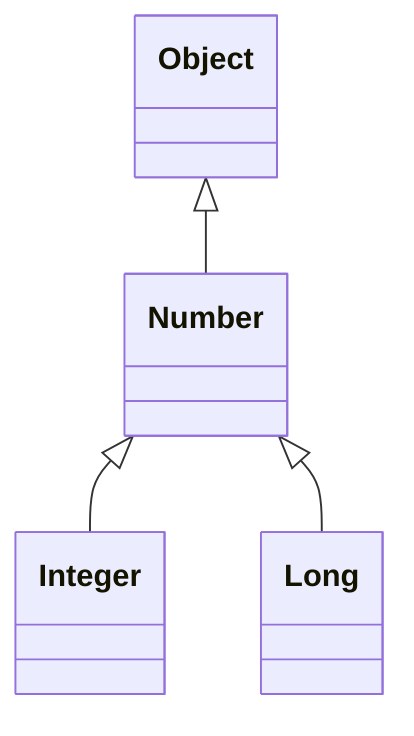

## invariant
### \<T>

| List\<Object>  | can cast |
|----------------|----------|
| List\<Object>  | ✅ yes    |
| List\<Number>  | ❌ no     |
| List\<Integer> | ❌ no     |
| List\<Long>    | ❌ no     |

```java
// Read and write

List<Integer> list = new ArrayList<>();

list.add(1);

System.out.println(list.get(0));
```

## covariant : upper bound
### \<? extends T>

| List\<? extends Number> | can cast |
|-------------------------|----------|
| List\<Object>           | ❌ no     |
| List\<Number>           | ✅ yes    |
| List\<Integer>          | ✅ yes    |
| List\<Long>             | ✅ yes    |

```java
// Read-only (supplier)

List<? extends Number> list = new ArrayList<Integer>(List.of(2));

System.out.println(list.get(0));

list.add(1); //compile time error


// Usage as parameter
double sumOfList(List<? extends Number> list) {
    double result = 0.0;
    for (Number n : list)
      result += n.doubleValue();
    return result;
}
```


## contra-variant : lower bound
### <? super T>

| List\<? super Integer> | can cast |
|------------------------|----------|
| List\<Object>          | ✅ yes    |
| List\<Number>          | ✅ yes    |
| List\<Integer>         | ✅ yes    |
| List\<Long>            | ❌ no     |


```java
// Writable* (consumer)

List<? super Integer> list = new ArrayList<>();

list.add(3);

System.out.println(list.get(0));


// Usage as parameter
void addNumber(List<? super Integer> list, int number) {
    list.add(number);
}
```