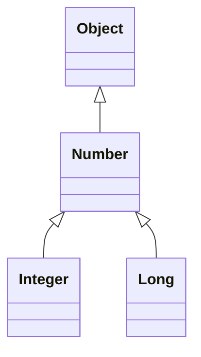

## invariant
### \<T>

| List\<Integer> | accepts  |
|----------------|----------|
| List\<Object>  | ❌ no    |
| List\<Number>  | ❌ no    |
| List\<Integer> | ✅ yes   |
| List\<Long>    | ❌ no    |

```java
// Read and write

List<Integer> list = new ArrayList<>();

list.add(11);
list.add(1);

System.out.println(list.get(0));
System.out.println(list.get(1));


// Note the differences 

List<Number> numbers = new ArrayList<>();

numbers.add(11);
numbers.add(1);

System.out.println(numbers.get(0));
System.out.println(numbers.get(1));


// Quiz A

System.out.println(list);     // [11, 1]
System.out.println(numbers);  // [11, 1]

Collections.sort(list);
Collections.sort(numbers);

System.out.println(list);     // ?
System.out.println(numbers);  // ?


// Quiz B

Collections.sort((List<Integer>) numbers);

System.out.println(numbers);  // ?
```

## covariant : upper bound
### \<? extends T>

| List\<? extends Number> | accepts  |
|-------------------------|----------|
| List\<Object>           | ❌ no    |
| List\<Number>           | ✅ yes   |
| List\<Integer>          | ✅ yes   |
| List\<Long>             | ✅ yes   |

```java
// Read-only (supplier)

List<Number> numbers = new ArrayList<>(List.of(11, .1));
List<? extends Number> list = numbers;

System.out.println(list.get(0));
System.out.println(list.get(1));

list.add(1); //compile time error


// Usage as parameter
double sumOfList(List<? extends Number> list) {
    double result = 0.0;
    for (Number n : list)
      result += n.doubleValue();
    return result;
}
```


## contra-variant : lower bound
### \<? super T>

| List\<? super Integer> | accepts  |
|------------------------|----------|
| List\<Object>          | ✅ yes   |
| List\<Number>          | ✅ yes   |
| List\<Integer>         | ✅ yes   |
| List\<Long>            | ❌ no    |


```java
// Writable (consumer)

List<Number> numbers = new ArrayList<>(List.of(11, .1));
List<? super Integer> list = numbers;

list.add(111);
list.add(11l); //compile time error

System.out.println(list.get(0));


// Usage as parameter
void addNumber(List<? super Integer> list, int number) {
    list.add(number);
}
```