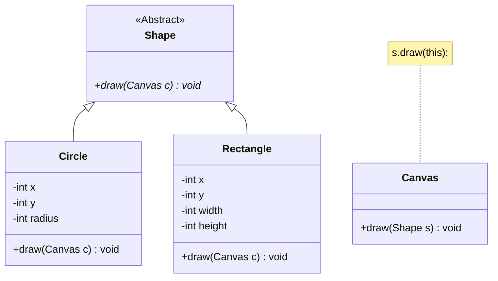

```mermaid
classDiagram

class Shape {
  <<Abstract>>
  +draw(Canvas c) void*
}

Shape <|-- Circle

class Circle {
  -int x
  -int y
  -int radius
  +draw(Canvas c) void
}

Shape <|-- Rectangle

class Rectangle {
  -int x
  -int y
  -int width
  -int height
  +draw(Canvas c) void
}

note for Canvas "s.draw(this);"
class Canvas {
  +draw(Shape s) void
}
```